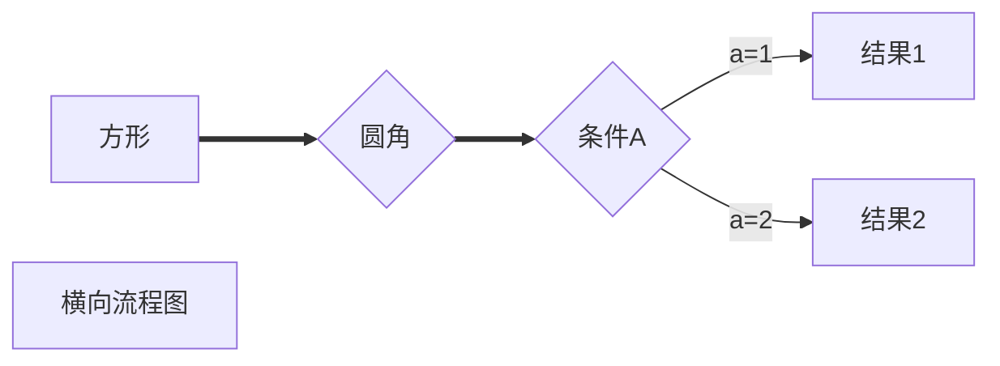

# markdown试用

## 写标题


```text
# xxxx就是一级标题，也可以使用多个#变换标题等级。亦或者ctrl+数字1~6
```

## 换行

这是一段文本

这是另一段文本

这是一段文本
这是另一段文本

```text
enter是大换行
shift+enter是小换行
```

## 分割线

```text
---或者***+回车
```


# 文字显示

## 字体

`````text
**粗体**   ctrl+B
~~删除线~~   shift+alt+5
<u>下划线</u>   ctrl+U
*斜体*    ctrl+L
==高亮==
保留*则\*
`````

**粗体**

~~删除线这是~~

<u>下划线这是</u>

*斜体*

==高亮==

## 上下标

```text
X^2^
H~2~O
```

X^2^

H~2~O

# 列表

## 无序列表

```text
*或/或-再按一下空格
连按两下回车退出
二级分类就tap一下
ctrl+shift+]
```

- 苹果

- 葡萄

  - 数学

  - 难过

    - BB

    

## 有序列表

```text
1.空格
ctrl+shift+[
```

1. 叫妈妈
2. 叫爸爸
3. 叫爷爷
   * 嘻嘻

## 任务列表

```text
- [空格] 吃早餐
-[x]吃晚餐
可以按一下勾选
```

- [ ] 吃早餐

- [x] 吃晚饭

## 区块显示

```text
>回车或空格
```


> 这是一层
>
> > 这是二层
> >
> > > 这是三层

# 链接

```text
[网站名字](链接)
```

[百度一下](https://www.baidu.com)

www.baidu.com

[文字显示](##文字显示)

# 脚注

```text
[^文本]
[^文本]：解释说明
```

奶奶[^1]

[^1]:你妈妈的妈妈<br>我使用了br关键字。

# 图片插入

```text

```


# 顺带一提

ctrl+T可以快速创建表格，不建议用代码打

| 123  | 459  | 737  |
| ---- | ---- | ---- |
|      |      |      |
|      |      |      |
|      |      |      |

# 流程图

````text
```mermaid
graph LR
A[方形]==>{条件A}
B==>C{条件A}
C-->|a=1|D[结果1]
C-->|a=2|E[结果2]
F[横向流程图]
```
````




