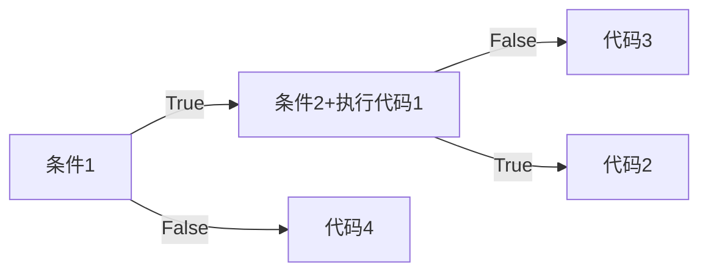

# if条件判断

```python
if 条件：
	满足时要做的事
else:
    不满足时要做的事
    
if 条件1：
	满足条件1做的事
elif  条件2：
	满足条件2做的事
elif 条件三:
    满足条件3要做的事
#elif可以有很多个    
```

==if是可以嵌套的==

```python
if 条件1：
	代码1
    if 条件2：
    	代码2
    else：
        代码3
else：
	代码4
```





# while循环

while条件:
	循环体（条件满足时要做的事）
	改变变量


死循环：

while True：
	循环体

# for循环

可以完成循环的功能，依次取出对象中的元素

格式：

for 临时变量 in 可迭代对象
	循环体

range循环是取数的range（1，6）#1 2 3 4 5

# 异常与异常处理

## 常见异常

* Attribute Error:试图访问一个对象没有的属性
* IO Error：输入/出异常；基本上是无法打开文件
* Import Error：无法引入模块或包：基本上是路径问题或名称错误
* Identation Error：语法错误（的子类）；代码没有正确对齐
* Index Error：下标索引超出序的边界
* Key Error：试图访问字典里不存在的键
* Key board Error：用户中断操作（通常是ctrl+C被摁下）
* Name Error：使用一个还未被赋予对象的变量
* Syntax Error：python代码非法，代码无法编译
* Type Error：传入对象类型与要求不和
* Value Error：传入一个调用者不期望的值

## 异常处理

为了在出错的情况下代码也能跑下去

### 语法格式1

```python
try:
    可能引发异常现象的代码 #并不确定能够正常运行的代码
except 异常类型：
	出现异常时的处理代码 #出现异常时希望执行的代码
```

#### 语法二

```python
try:
    print(a)
except Name Error as e:
	print(e)
b = 10
print(b)

#name 'a' is not defined
#10
```

#### 语法三

```python
try:
    print(a)
except Exception as e:  # 万能的Exception可以捕获任何异常
	print(e)
```

#### 语法四 多分枝错误

```python
try:
    print(a)
except IndexError as e:
    print(e)
except KeyError as e:
    print(e)
except NameError as e:
    print(e)
```

### 语法格式2

```python
try:
except:
else:   
```

try结束后有异常运行except，无异常运行else

### 语法格式3

```python
try:
except:  #可以没有
finally:
```

try结束后无论有没有异常都会执行finally

## 抛出异常

首先创建一个Exception（‘xxxxx’）对象，xxxxx——异常提示信息

然后raise抛出这个对象（异常对象）

```python
def login():
    pwd = input('请输入你的密码')
    if  len(pwd)>=6
    	return '密码输入成功’
    raise Exception('长度不足6位，密码输入无效')
    
try:
    print(login())
except Exception as e:
    print(e)
```

# lambda匿名函数

```python
lambda arguments: expression
```

* lambda是 Python 的关键字，用于定义 lambda 函数
* arguments 是参数列表，可以包含零个或多个参数，但必须在冒号(`:`)前指定
* expression是一个表达式，用于计算并返回函数的结果

```python
x = lambda a : a + 10
print(x(5))

#15
```

# map函数

**map()** 会根据提供的函数对指定序列做映射。

第一个参数 function 以参数序列中的每一个元素调用 function 函数，返回包含每次 function 函数返回值的新列表

```python
map(function, iterable, ...)
```

* function是一个函数
* iterable是一个或多个序列

```python
map(lambda x: x ** 2, [1, 2, 3, 4, 5])  # 使用 lambda 匿名函数
#[1, 4, 9, 16, 25]
```

# filter函数

**filter()** 函数用于过滤序列，过滤掉不符合条件的元素，返回由符合条件元素组成的新列表

```python
filter(function, iterable)
```

* function是一个函数
* iterable是可迭代对象

```python
def is_odd(n):
    return n % 2 == 1
 
newlist = filter(is_odd, [1, 2, 3, 4, 5, 6, 7, 8, 9, 10])
print(newlist)

#[1, 3, 5, 7, 9]
```

