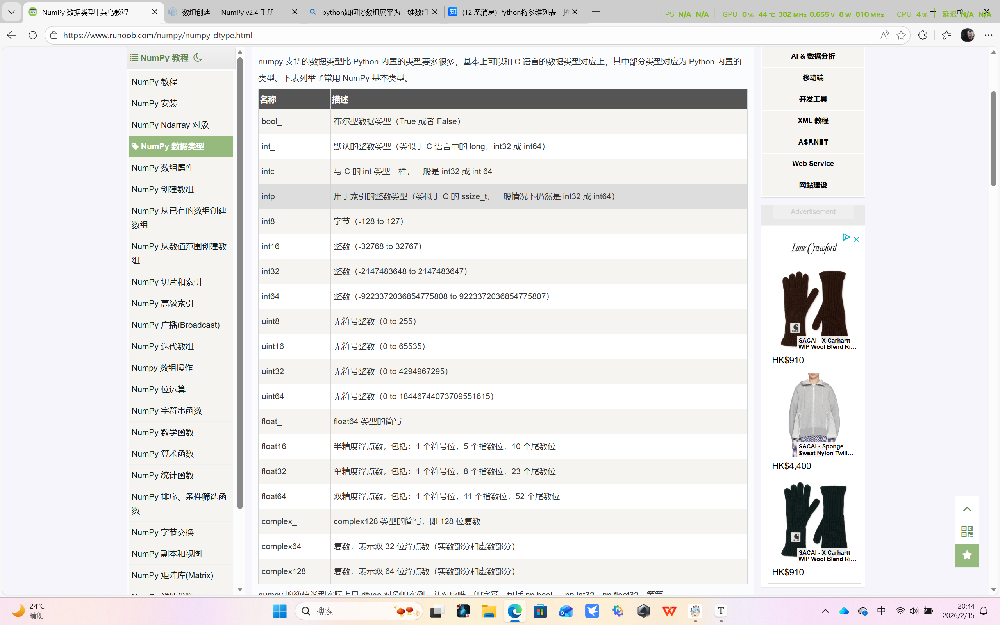

# 数据类型



```python
numpy.dtype(object, align, copy)
```

- object - 要转换为的数据类型对象
- align - 如果为 true，填充字段使其类似 C 的结构体。
- copy - 复制 dtype 对象 ，如果为 false，则是对内置数据类型对象的引用

**例如**

```python
import numpy as np
# int8, int16, int32, int64 四种数据类型可以使用字符串 'i1', 'i2','i4','i8' 代替
dt = np.dtype('i4')
print(dt)

#int32
```

直接print（xxx.detype）也能出其数据类型

```python
import numpy as np
 
student = np.dtype([('name','S20'), ('age', 'i1'), ('marks', 'f4')]) 
a = np.array([('abc', 21, 50),('xyz', 18, 75)], dtype = student) 
print(a)

# [(b'abc', 21, 50.) (b'xyz', 18, 75.)]
```

b代表字符串

| 字符 | 对应类型              |
| :--- | :-------------------- |
| b    | 布尔型                |
| i    | (有符号) 整型         |
| u    | 无符号整型 integer    |
| f    | 浮点型                |
| c    | 复数浮点型            |
| m    | timedelta（时间间隔） |
| M    | datetime（日期时间）  |
| O    | (Python) 对象         |
| S, a | (byte-)字符串         |
| U    | Unicode               |
| V    | 原始数据 (void)       |

# 数据属性

| 属性               | 说明                                                         |
| :----------------- | :----------------------------------------------------------- |
| `ndarray.ndim`     | 数组的秩（rank），即数组的维度数量或轴的数量。               |
| `ndarray.shape`    | 数组的维度，表示数组在每个轴上的大小。对于二维数组（矩阵），表示其行数和列数。 |
| `ndarray.size`     | 数组中元素的总个数，等于 `ndarray.shape` 中各个轴上大小的乘积。 |
| `ndarray.dtype`    | 数组中元素的数据类型。                                       |
| `ndarray.itemsize` | 数组中每个元素的大小，以字节为单位。                         |
| `ndarray.flags`    | 包含有关内存布局的信息，如是否为 C 或 Fortran 连续存储，是否为只读等。 |
| `ndarray.real`     | 数组中每个元素的实部（如果元素类型为复数）。                 |
| `ndarray.imag`     | 数组中每个元素的虚部（如果元素类型为复数）。                 |
| `ndarray.data`     | 实际存储数组元素的缓冲区，一般通过索引访问元素，不直接使用该属性。 |

调整shape可以直接重新a.shape = （ ，）或者是reshape（）

化为一维列表可用numpy.ravel（xxx）

# 创建数组

```python
numpy.zeros(shape, dtype = float, order = 'C')
```

用0填充

| 参数  | 描述                                                |
| :---- | :-------------------------------------------------- |
| shape | 数组形状                                            |
| dtype | 数据类型，可选                                      |
| order | 'C' 用于 C 的行数组，或者 'F' 用于 FORTRAN 的列数组 |

```python
numpy.ones(shape, dtype = None, order = 'C')
```

用1填充

| 参数  | 描述                                                |
| :---- | :-------------------------------------------------- |
| shape | 数组形状                                            |
| dtype | 数据类型，可选                                      |
| order | 'C' 用于 C 的行数组，或者 'F' 用于 FORTRAN 的列数组 |

numpy.zeros_like 用于创建一个与给定数组具有相同形状的数组，数组元素以 0 来填充。

numpy.zeros 和 numpy.zeros_like 都是用于创建一个指定形状的数组，其中所有元素都是 0。

它们之间的区别在于：numpy.zeros 可以直接指定要创建的数组的形状，而 numpy.zeros_like 则是创建一个与给定数组具有相同形状的数组。

```
numpy.zeros_like(a, dtype=None, order='K', subok=True, shape=None)
```

参数说明：

| 参数  | 描述                                                         |
| :---- | :----------------------------------------------------------- |
| a     | 给定要创建相同形状的数组                                     |
|       |                                                              |
| dtype | 创建的数组的数据类型                                         |
| order | 数组在内存中的存储顺序，可选值为 'C'（按行优先）或 'F'（按列优先），默认为 'K'（保留输入数组的存储顺序） |
| subok | 是否允许返回子类，如果为 True，则返回一个子类对象，否则返回一个与 a 数组具有相同数据类型和存储顺序的数组 |
| shape | 创建的数组的形状，如果不指定，则默认为 a 数组的形状。        |

```
numpy.ones_like(a, dtype=None, order='K', subok=True, shape=None)
```

这个与zeros同理

# 创建根据数值的数组

==numpy.linspace 函数用于创建一个一维数组，数组是一个等差数列构成的，格式如下：==

```
np.linspace(start, stop, num=50, endpoint=True, retstep=False, dtype=None)
```

参数说明：

| 参数       | 描述                                                         |
| :--------- | :----------------------------------------------------------- |
| `start`    | 序列的起始值                                                 |
| `stop`     | 序列的终止值，如果`endpoint`为`true`，该值包含于数列中       |
| `num`      | 要生成的等步长的样本数量，默认为`50`                         |
| `endpoint` | 该值为 `true` 时，数列中包含`stop`值，反之不包含，默认是True。 |
| `retstep`  | 如果为 True 时，生成的数组中会显示间距，反之不显示。         |
| `dtype`    | `ndarray` 的数据类型                                         |

```python
import numpy as np
a =np.linspace(1,10,10,retstep= True)
 
print(a)
# 拓展例子
b =np.linspace(1,10,10).reshape([10,1])
print(b)
```

==numpy.logspace 函数用于创建一个于等比数列。格式如下：==

```
np.logspace(start, stop, num=50, endpoint=True, base=10.0, dtype=None)
```

base 参数意思是取对数的时候 log 的下标。

| 参数       | 描述                                                         |
| :--------- | :----------------------------------------------------------- |
| `start`    | 序列的起始值为：base ** start                                |
| `stop`     | 序列的终止值为：base ** stop。如果`endpoint`为`true`，该值包含于数列中 |
| `num`      | 要生成的等步长的样本数量，默认为`50`                         |
| `endpoint` | 该值为 `true` 时，数列中中包含`stop`值，反之不包含，默认是True。 |
| `base`     | 对数 log 的底数。                                            |
| `dtype`    | `ndarray` 的数据类型                                         |

# 高级索引切片

```python
import numpy as np 
 
x = np.array([[  0,  1,  2],[  3,  4,  5],[  6,  7,  8],[  9,  10,  11]])  
print ('我们的数组是：' )
print (x)
print ('\n')
rows = np.array([[0,0],[3,3]]) 
cols = np.array([[0,2],[0,2]]) 
y = x[rows,cols]  
print  ('这个数组的四个角元素是：')
print (y)

#我们的数组是：
[[ 0  1  2]
 [ 3  4  5]
 [ 6  7  8]
 [ 9 10 11]]


这个数组的四个角元素是：
[[ 0  2]
 [ 9 11]]
```

([[0,0],[3,3]]) 
([[0,2],[0,2]]) 

要竖着看（0，0）  （ 0，2） （3，0）  （3，2）

```python
import numpy as np
 
a = np.array([[1,2,3], [4,5,6],[7,8,9]])
b = a[1:3, 1:3]
c = a[1:3,[1,2]]
d = a[...,1:]
print(b)
print(c)
print(d)
'''
[[5 6]
 [8 9]]
[[5 6]
 [8 9]]
[[2 3]
 [5 6]
 [8 9]]
'''
```

b = 1, 1  1,2  2,1  2,2   b的1:3是行  右边是列

```python
import numpy as np 
 
x = np.array([[  0,  1,  2],[  3,  4,  5],[  6,  7,  8],[  9,  10,  11]])  
print ('我们的数组是：')
print (x)
print ('\n')
# 现在我们会打印出大于 5 的元素  
print  ('大于 5 的元素是：')
print (x[x >  5])

'''
我们的数组是：
[[ 0  1  2]
 [ 3  4  5]
 [ 6  7  8]
 [ 9 10 11]]


大于 5 的元素是：
[ 6  7  8  9 10 11]
'''
```

```python
import numpy as np 
 
a = np.array([np.nan,  1,2,np.nan,3,4,5])  
print (a[~np.isnan(a)])

#[ 1.   2.   3.   4.   5.]
```

# 广播

```python
import numpy as np 
 
a = np.array([1,2,3,4]) 
b = np.array([10,20,30,40]) 
c = a * b 
print (c)

#[ 10  40  90 160]
```

行列数不同时

```python
import numpy as np 
 
a = np.array([[ 0, 0, 0],
           [10,10,10],
           [20,20,20],
           [30,30,30]])
b = np.array([0,1,2])
print(a + b)

'''
[[ 0  1  2]
 [10 11 12]
 [20 21 22]
 [30 31 32]]

'''
```

**广播的规则:**

- 让所有输入数组都向其中形状最长的数组看齐，形状中不足的部分都通过在前面加 1 补齐。
- 输出数组的形状是输入数组形状的各个维度上的最大值。
- 如果输入数组的某个维度和输出数组的对应维度的长度相同或者其长度为 1 时，这个数组能够用来计算，否则出错。
- 当输入数组的某个维度的长度为 1 时，沿着此维度运算时都用此维度上的第一组值。

**简单理解：**对两个数组，分别比较他们的每一个维度（若其中一个数组没有当前维度则忽略），满足：

- 数组拥有相同形状。
- 当前维度的值相等。
- 当前维度的值有一个是 1。

若条件不满足，抛出 **"ValueError: frames are not aligned"** 异常。

#  矩阵转置

Numpy提供了多种方法来实现数组的转置操作，适用于不同维度的数据处理需求。

使用 .T 属性进行简单转置

*.T* 是最简单的方式，用于二维数组的行列互换。

import numpy as np

arr = np.array([[1, 2, 3], [4, 5, 6]])

transposed = arr.T

print(transposed)

\# 输出:

\# [[1 4]

\# [2 5]

\# [3 6]]


使用 np.transpose() 指定轴顺序

*np.transpose()* 可用于高维数组，通过指定轴顺序实现复杂转置。

arr = np.array([[[1, 2], [3, 4]], [[5, 6], [7, 8]]])

transposed = np.transpose(arr, axes=(1, 0, 2))

print(transposed)

\# 输出:

\# [[[1 2]

\# [5 6]]

\# [[3 4]

\# [7 8]]]


使用 np.swapaxes() 交换两个轴

*swapaxes()* 用于交换数组中的两个指定轴。

arr = np.array([[[1, 2], [3, 4]], [[5, 6], [7, 8]]])

swapped = np.swapaxes(arr, 0, 2)

print(swapped)

\# 输出:

\# [[[1 5]

\# [3 7]]

\# [[2 6]

\# [4 8]]]


注意事项

- *.T* 属性仅适用于二维数组，等价于 *np.transpose()*。
- 对于高维数组，需明确指定轴顺序以避免数据混乱。
- *swapaxes()* 是 *transpose()* 的特殊情况，仅交换两个轴。

这些方法灵活且高效，可根据实际需求选择合适的方式处理多维数据。

# 矩阵的逆

```python
import numpy as np
matrix = np.array([[1, 2], [3, 4]])
inverse_matrix = np.linalg.inv(matrix)
print(inverse_matrix)

'''
[[-2. 1. ]
[ 1.5 -0.5]]
'''
```

# 矩阵乘法

```
numpy.dot(a, b, out=None) 
```

**参数说明：**

- **a** : ndarray 数组
- **b** : ndarray 数组
- **out** : ndarray, 可选，用来保存dot()的计算结果

```python
import numpy.matlib
import numpy as np
 
a = np.array([[1,2],[3,4]])
b = np.array([[11,12],[13,14]])
print(np.dot(a,b))

'''
[[37  40] 
 [85  92]]
 '''
```
